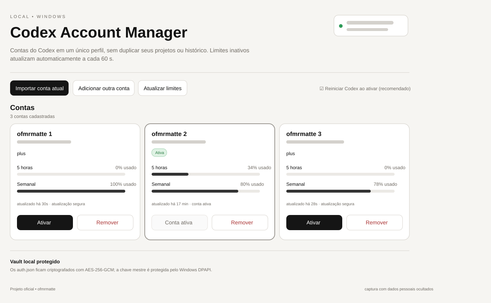

# Codex Account Manager

[English](README.en.md) | **Português**

Gerenciador local de múltiplas contas do Codex para Windows, mantido por **ofmrmatte**. O projeto permite alternar manualmente entre contas sem duplicar projetos, histórico, sessões, MCPs, configurações ou Skills.

> Repositório oficial deste projeto: `ofmrmatte/Codex-Account-Manager`. Projeto independente da comunidade; não é um produto da OpenAI e não implica afiliação ou endosso da OpenAI.



## Principais recursos

- Troca manual entre múltiplas contas do Codex.
- Um único `%USERPROFILE%\.codex` para projetos, histórico, sessões, MCPs, configurações e Skills.
- Vault local com AES-256-GCM.
- Chave mestre protegida por Windows DPAPI (`CurrentUser`).
- Servidor local restrito a `127.0.0.1`.
- Reautenticação isolada pelo fluxo oficial `account/login/start` do `codex app-server`.
- Consulta dos limites via `account/rateLimits/read`.
- Atualização automática dos limites das contas inativas a cada 60 segundos.
- Nenhum upload de tokens para serviços do projeto.
- Nenhuma cópia de `sessions/` e nenhuma escrita em `state_5.sqlite`.

## Como funciona

O gerenciador mantém o ambiente normal do Codex em:

```text
%USERPROFILE%\.codex
```

As contas adicionais ficam no vault local criptografado. Ao ativar uma conta, o gerenciador troca somente:

```text
%USERPROFILE%\.codex\auth.json
```

Projetos e dados de trabalho permanecem no mesmo perfil.

## Requisitos

- Windows 11
- Node.js 22 ou superior
- Codex CLI disponível no `PATH`
- Codex Desktop opcional

## Instalação

Clone ou baixe o repositório e execute no PowerShell:

```powershell
Set-ExecutionPolicy -Scope Process Bypass
.\Install.ps1
```

Depois abra o atalho **Codex Account Manager**.

## Adicionar ou reautenticar uma conta

1. Abra o gerenciador.
2. A conta ativa pode ser importada na primeira execução.
3. Clique em **Adicionar outra conta** ou **Reautenticar**.
4. O Manager inicia um `codex app-server` em um `CODEX_HOME` isolado.
5. O navegador abre o login do ChatGPT.
6. Conclua a autenticação da conta desejada.
7. Volte ao painel e clique em **Concluir login** quando solicitado.
8. A nova credencial é gravada no vault criptografado.

A troca entre contas é sempre iniciada manualmente pelo usuário. O projeto não realiza rotação automática baseada em limite de uso.

## Limites de uso

O Manager usa `account/rateLimits/read` por meio do `codex app-server`.

- Contas inativas são consultadas em homes temporários sob `%LOCALAPPDATA%\CodexAccountManager\runtime\`.
- A conta ativa não recebe uma segunda instância concorrente do app-server enquanto o Codex Desktop está em execução.
- Ao trocar de conta, o snapshot da conta que está sendo deixada pode ser atualizado com segurança.
- O botão **Atualizar limites** não encerra o Codex Desktop.

## Segurança

- Vault: AES-256-GCM.
- Proteção da chave: Windows DPAPI (`CurrentUser`).
- Bind local: `127.0.0.1`.
- Sem serviço em nuvem próprio.
- Sem telemetria adicionada pelo projeto.
- Sem armazenamento de tokens em texto puro dentro do repositório.

Nunca faça commit de `auth.json`, `accounts.vault`, `master-key.dpapi` ou diretórios de runtime locais.

## Atualização

Para atualizar uma instalação existente preservando o vault e a chave DPAPI:

```powershell
.\Update.ps1
```

## Desinstalação

```powershell
& "$env:LOCALAPPDATA\CodexAccountManager\Uninstall.ps1"
```

O `~/.codex`, projetos, sessões, Skills e MCPs não são apagados.

## Versão estável

**v1.2.2**

Esta versão estabiliza o fluxo de troca entre contas, reautenticação isolada e atualização segura de limites sem fechar o Codex Desktop.

## Licença

Distribuído sob a [MIT License](LICENSE).

Copyright © 2026 Matheus Ferreira.

## Créditos

A arquitetura foi inspirada no projeto MIT `mahirozdin/Codex-Multi-Account-Manager`. Consulte [THIRD_PARTY_NOTICES.md](THIRD_PARTY_NOTICES.md).
